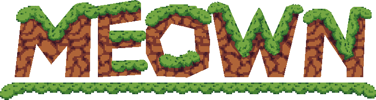
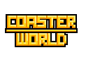
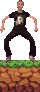

# Hello❕, I'm [Orago](https://orago.me)

Hello I'm Orago, I love doing Orago things.

🌎 Creating online games for everyone to play.

---

## Current Projects

> # 
> [Website](https://meown.net) | [Discord](https://discord.gg/9cCF293A8Y)
>
> Meown is a game of games, where your player can join minigames and
> keep all of the same clothing and items you've earned and use it in almost any other minigame.
> The idea was to originally create a MMO platformer building minigame,
> but I instead created a MMO topdown building minigame first.
> The goal is to keep making more minigames similar to the experience of what Club Penguin used to be.
> Parks and worlds are two seperate minigames and the goal is for them to have nearly nothing in common
> #

> 
> # Coaster World
>
> Hehe roller coaster go wee
> (Website N/A) | [Discord](https://discord.gg/9cCF293A8Y)
> #
---
# ~ I love silly cats and making silly games

